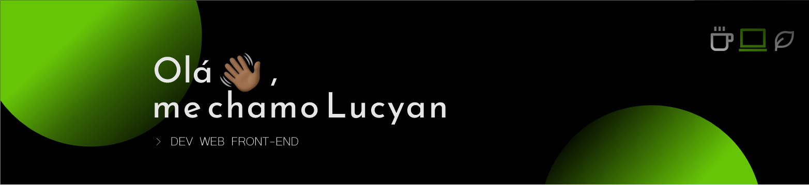

Sou graduando no curso de Sistemas de Informação pela UFRRJ e desenvolvedor web com foco atual em Front-end, entusiasta das tecnologias JavaScript. 

No momento, meu foco de estudos é em React.js e em Node.js - em um futuro próximo, viso me tornar um desenvolvedor Full Stack.
Sou aluno na [Rocketseat](https:/rocketseat.com) e desenvolvo projetos freelance - aberto a oportunidades 🙋🏾‍♂️

Também amo café, ouvir todo tipo de música e estou disponível para conexões e trocas de ideias!

📌 [Meu portifólio](https://lucyanovidio.vercel.app)

 

   
   
 

 
 
 
 
 
 
 

 ### Minhas redes
 
 
 
 
 
 
 
 

